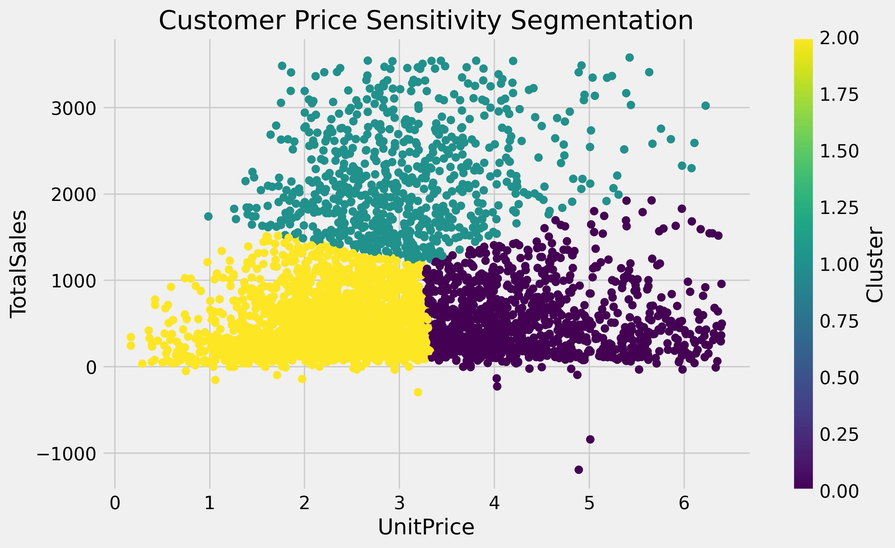
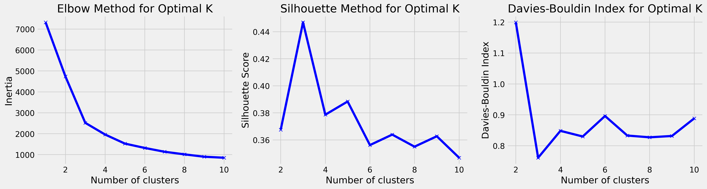
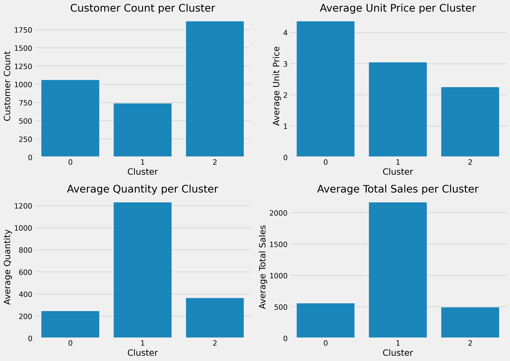

# customer-segmentation
Clustering project to segment customers based on price sensitivity and purchasing behavior for effective pricing strategies.
# Harnessing Price Sensitivity for Effective Customer Segmentation with K-Means Clustering

## Overview
This project explores customer segmentation using **K-Means Clustering** to analyze **price sensitivity** and **purchasing behavior**. By dividing customers into distinct segments, businesses can craft more effective pricing strategies and improve overall customer satisfaction.

For more details, check out:
- The full [Medium article](https://medium.com/@cynthiaakiotu/harnessing-price-sensitivity-for-effective-customer-segmentation-with-k-means-clustering-c08ccc2a5e6e).
- The complete [YouTube video walkthrough](https://youtu.be/Rt7ySuJcuA4?si=NoMVjV9ziadJydLh).


---

## Table of Contents
- [Overview](#overview)
- [Features](#features)
- [Dataset](#dataset)
- [Methodology](#methodology)
- [Results](#results)
- [How to Use](#how-to-use)
- [Folder Structure](#folder-structure)
- [Blog Post](#blog-post)
- [Video Walkthrough](#video-walkthrough)
- [License](#license)

---

## Features
- Cluster customers into distinct groups based on purchasing behavior.
- Analyze metrics such as unit price, total sales, and quantity purchased.
- Determine the optimal number of clusters using:
  - **Elbow Method**
  - **Silhouette Scores**
  - **Davies-Bouldin Index**
- Provide actionable insights for improving pricing strategies.

---

## Dataset
- **Source:** Proprietary data (or specify the source if publicly available).
- **Key Features:**
  - `UnitPrice`: Price per unit of a product.
  - `TotalSales`: Total monetary value of sales per customer.
  - `Quantity`: Total number of items purchased.
  - Any other relevant features used for clustering.

---

## Methodology
1. **Exploratory Data Analysis (EDA):**
   - Identified outliers and visualized feature distributions.
2. **Data Preprocessing:**
   - Scaled features using **StandardScaler** to ensure uniformity.
   - Selected relevant features (`UnitPrice`, `TotalSales`) for clustering.
3. **Clustering:**
   - Used **K-Means Clustering** to group customers into distinct segments.
   - Determined the optimal number of clusters using:
     - **Elbow Method**: To analyze the inertia curve.
     - **Silhouette Method**: To measure intra-cluster cohesion and inter-cluster separation.
     - **Davies-Bouldin Index**: To evaluate cluster compactness and separation.
4. **Visualization:**
   - Visualized customer clusters using scatterplots.
   - Analyzed cluster characteristics (e.g., average sales, unit price).

---

## Results
- **Optimal Number of Clusters:** 3
- **Cluster Insights:**
  - **Cluster 1:** High-spending, low-frequency customers.
  - **Cluster 2:** Moderate-spending, medium-frequency customers.
  - **Cluster 3:** Price-sensitive, high-frequency customers.

### Key Visualizations
1. **Customer Segmentation:**
   

2. **Optimal K Determination:**
   

3. **Cluster Characteristics:**
   

---

## How to Use
1. **Clone the repository:**
   ```bash
   git clone https://github.com/CynthiaTheDataTechie/customer-segmentation.git
   cd customer_segmentation
pip install -r requirements.txt
jupyter notebook Harnessing_Price_Sensitivity_for_Effective_Customer_Segmentation_with_K_Means_Clustering.ipynb
## Folder Structure

customer_segmentation/
├── src/                     # Reusable Python scripts
│   ├── data_preprocessing.py
│   ├── clustering.py
│   ├── visualization.py
│   ├── README.md
├── results/                 # Analysis outputs
│   ├── figures/             # Saved plots and visualizations
│   ├── README.md
├── Harnessing_Price_Sensitivity_for_Effective_Customer_Segmentation_with_K_Means_Clustering.ipynb  # Main notebook
├── requirements.txt         # Python dependencies
├── LICENSE                  # License for the project
├── README.md                # Main README


---

## Blog Post

This project is detailed in a comprehensive blog post that covers:
- Step-by-step methodologies for clustering and segmentation.
- How to use evaluation metrics like the Elbow Method and Silhouette Score.
- Visualizations and insights into customer purchasing behavior.

Read the full blog post here:

[Harnessing Price Sensitivity for Effective Customer Segmentation with K-Means Clustering](https://medium.com/@cynthiaakiotu/harnessing-price-sensitivity-for-effective-customer-segmentation-with-k-means-clustering-c08ccc2a5e6e)

---

## Video Walkthrough

Watch the complete walkthrough of the project, including methodologies, results, and visualizations, in the video:

[](https://youtu.be/Rt7ySuJcuA4?si=NoMVjV9ziadJydLh)

---

## License

This project is licensed under the **MIT License**. See the [LICENSE](LICENSE) file for details.


